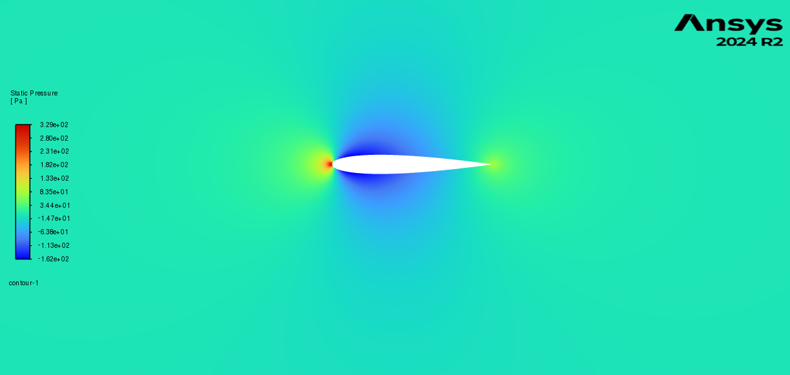
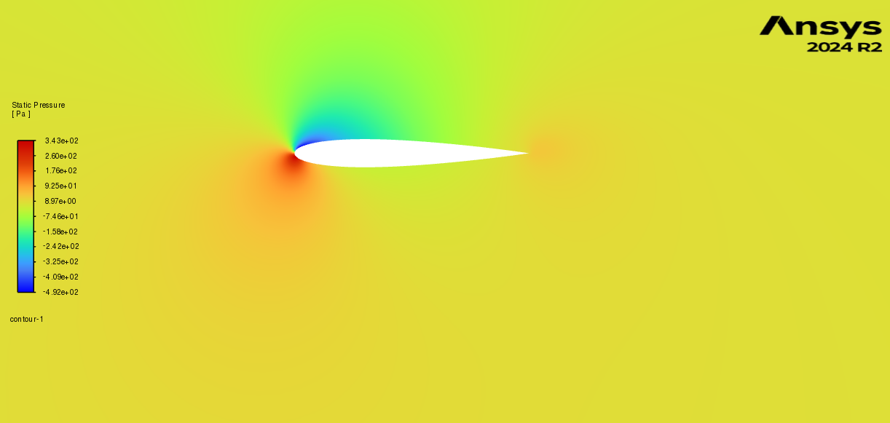
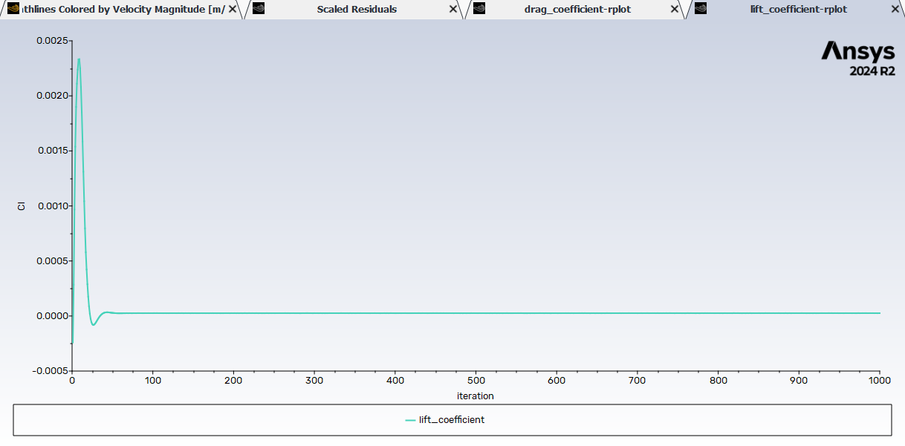
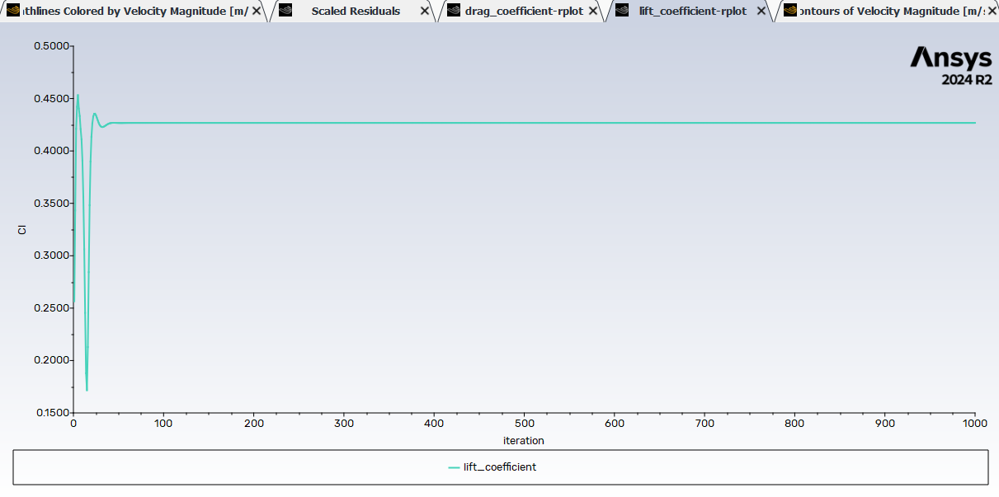
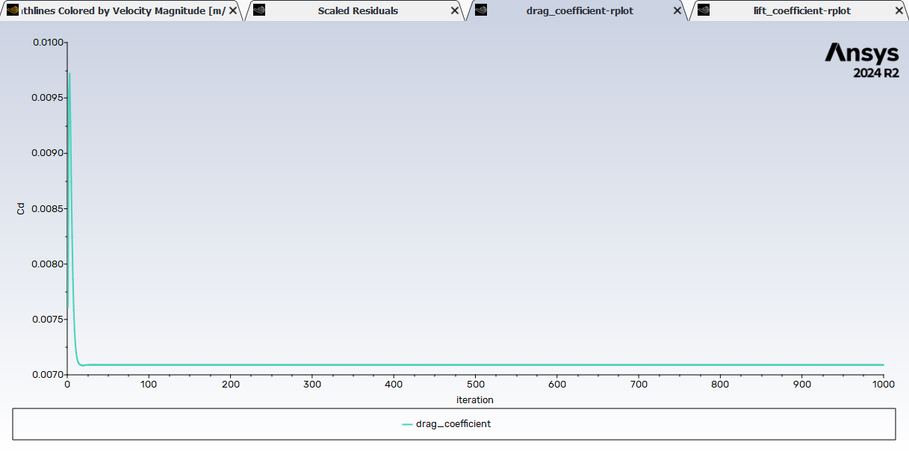
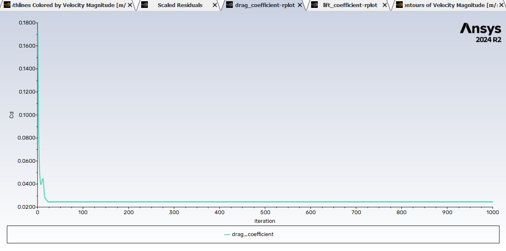
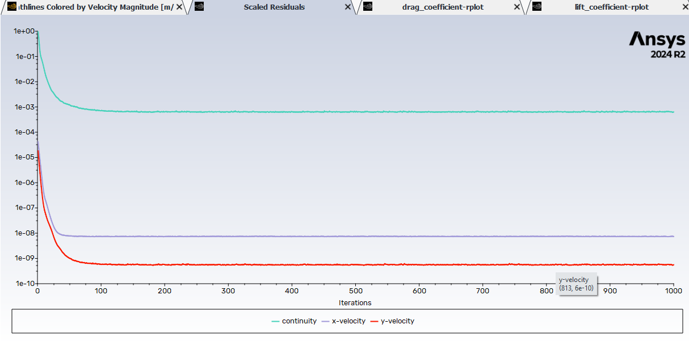
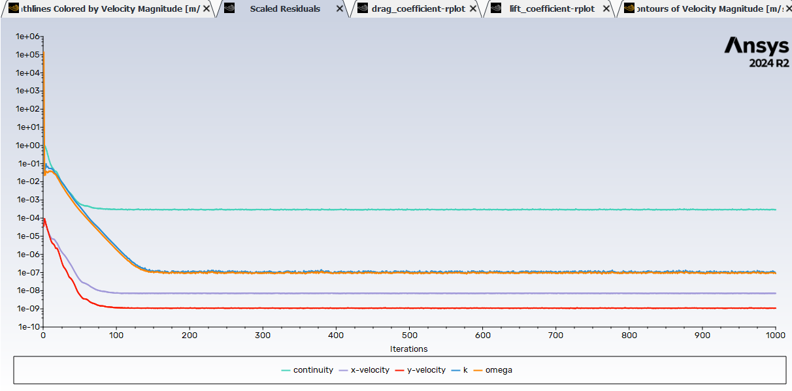

# CFD Simulation of NACA 0012 Airfoil

This repository contains the complete ANSYS Fluent project for a Computational Fluid Dynamics (CFD) analysis of incompressible flow over a NACA 0012 airfoil at two angles of attack (0° and 5°). The study investigates the aerodynamic performance and visualizes flow field behavior, including velocity, pressure, and streamlines.

## Project Overview
  
- **Course:** ME 207 – Fluid Dynamics  
- **Date:** April 19, 2025  
- **Solver Used:** ANSYS Fluent  
- **Airfoil:** NACA 0012  
- **Freestream Velocity:** 25 m/s  
- **Temperature:** 20°C  
- **Mesh Type:** C-type structured mesh  
- **Turbulence Models:**
  - 0° AOA: Laminar model  
  - 5° AOA: SST k–ω (low-turbulence)

## Objectives

1. Compute drag and lift coefficients at 0° and 5° AOA
2. Visualize velocity, pressure, and streamline contours
3. Analyze and interpret the aerodynamic behavior

## Project Structure

| Path                                             | Description                         |
|--------------------------------------------------|-------------------------------------|
| `yug_NACA_0012/`                                 | Root project folder                 |
| ├── `yug_NACA_0012.wbpj`                         | ANSYS Workbench Project File        |
| ├── `yug_NACA_0012_files/`                       | Main ANSYS data files               |
| │   ├── `dp0/FFF-1/Fluent/`                      | Fluent solver files and results     |
| │   ├── `dp0/FFF-1/MECH/`                        | Mechanical/mesh files               |
| │   ├── `dp0/FFF-1/Post/`                        | Post-processing setup               |
| │   ├── `progress_files/`                        | Simulation plots and contour images |
| │   └── `session_files/`                         | Workbench journal files             |
| └── `.yug_NACA_0012_files.backup/`               | Backup of original simulation       |

## Results Summary

| AOA | Coefficient | ANSYS Result | Literature |
|-----|-------------|--------------|------------|
| 0°  | CD          | 0.0069       | 0.0065     |
| 0°  | CL          | ~0           | 0          |
| 5°  | CD          | 0.0024       | 0.0060     |
| 5°  | CL          | 0.42         | 0.50       |

- Symmetric flow at 0° with negligible lift.
- At 5°, lift generation consistent with classical thin-airfoil theory.
- Small laminar separation bubble at 5° AOA.

## Visualizations

You can include these plots in the README for clarity:

### Mesh and Geometry

|  |  |
|-------------------------|-------------------------|
| *Figure 1: Mesh View 1* | *Figure 2: Mesh View 2* |

|  |  |
|-------------------------|-------------------------|
| *Figure 3: Mesh View 3* | *Figure 4: Mesh View 4* |

### Streamline and Velocity Contour

|  |  |
|-----------------------------|-----------------------------|
| *Figure 5: Streamline for 0 degree AOA*     | *Figure 6: Streamline for 5 degree AOA*     |

|  |  |
|-----------------------------|-----------------------------|
| *Figure 7: Velocity Contour for 0 degree AOA*     | *Figure 8: Velocity Contour for 5 degree AOA*     |

### Pressure Contours (from PDF screenshots)

You can manually crop and add the following from the PDF report (`23110370_CFD.pdf`):
- Static pressure contours (Fig. 15, 26)
  
|  |  |
|-------------------------|-------------------------|
| *Figure 9: Static Pressure contour at 0 degree AOA* | *Figure 10: Static Pressure contour at 5 degree AOA* |

- Residuals & coefficient convergence plots (Figs. 19–21, 30–32)

|  |  |
|-----------------------------|-----------------------------|
| *Figure 11: Lift Coefficient Plots at 0 degree AOA*     | *Figure 12: Lift Coefficient Plots at 5 degree AOA*     |

|  |  |
|-----------------------------|-----------------------------|
| *Figure 13: Drag Coefficient Plots at 0 degree AOA*     | *Figure 14: Drag Coefficient Plots at 5 degree AOA*     |

|  |  |
|-----------------------------|-----------------------------|
| *Figure 15: Scaled Residual Plots at 0 degree AOA*     | *Figure 16: Scaled Residual Plots at 5 degree AOA*     |
  
## How to Run

1. Open `yug_NACA_0012.wbpj` in ANSYS Workbench.
2. Load the `FFF-1` Fluent cell and double-click to launch the Fluent solver.
3. Set angle of attack through boundary conditions.
4. Initialize and run the simulation.
5. Post-process using contour and streamline tools.

## Key Learnings

- Importance of proper turbulence modeling at low Reynolds numbers.
- Significance of mesh quality (y+ < 1) for boundary layer resolution.
- Use of SST k–ω for stabilizing near-laminar simulations at small AOAs.

## References

- Anderson, J.D., *Fundamentals of Aerodynamics*
- NACA 0012 airfoil data (Thin airfoil theory)
- ANSYS Fluent User Guide

## Report

For a complete explanation of methodology and results, refer to the [`23110370_CFD.pdf`](./23110370_CFD.pdf) report.

---

> **Note:** This project was developed for academic purposes under ME 207: Fluid Dynamics.

